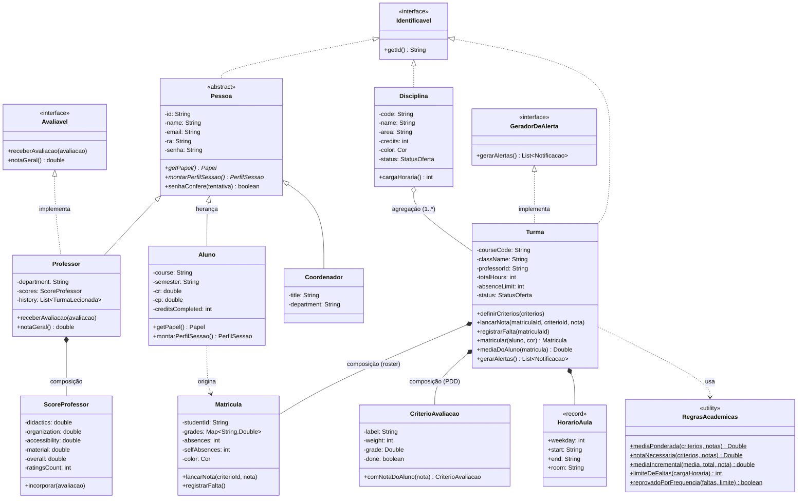
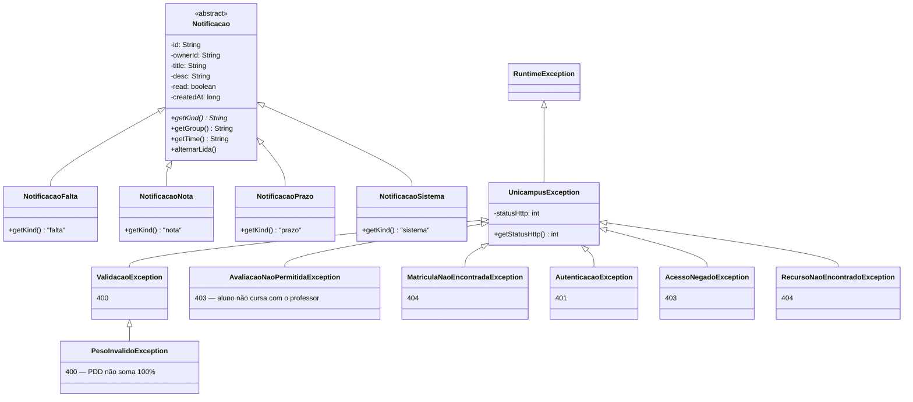
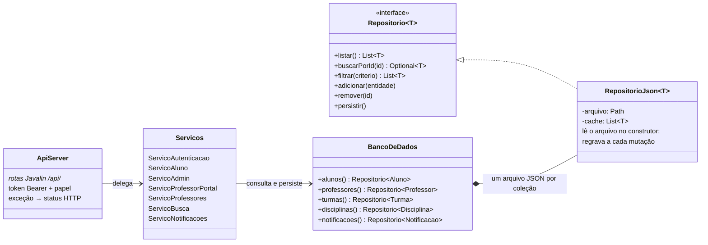

<p align="center">
  
</p>

# Unicampus — Gestão Acadêmica (MC322 · Trabalho Final)

App de gestão acadêmica da Unicamp com três papéis — **Aluno**, **Professor** e
**Coordenação (Admin)** — cada um com seu próprio dashboard.

| Parte | Pasta | Stack |
|---|---|---|
| Frontend (interface web) | [`frontend/`](frontend/) | React + Vite + TypeScript (MVVM) |
| Backend (API REST) | [`backend/`](backend/) | Java 17 + Gradle + Javalin (POO, arquivos JSON, JUnit 5) |

## 🎬 Demo

<p align="center">

</p>

<p align="center">
  🎥 <b><a href="video-apresentacao/out/UnicampusTrailer.mp4">Assista ao trailer completo em 1080p</a></b> — todas as funcionalidades em 60 segundos.
</p>

| 📱 Matrícula em poucos toques | 📱 Avaliação de professores |
| :---: | :---: |
|  |  |

| 🧑‍🏫 Professor — lançamento de notas | 🏛️ Coordenação — gestão de turmas |
| :---: | :---: |
|  |  |

<details>
<summary>📸 Mais telas do app (aluno)</summary>
<p align="center">


</p>
</details>


## Rodando o sistema completo

### Pré-requisitos

| Parte | Requisito | Observação |
|---|---|---|
| **Backend** | **JDK 17+** (Java 17) | Único requisito. O **Gradle não precisa ser instalado** — o wrapper `./gradlew` baixa a versão certa (9.4.1) na primeira execução. Deixe a **porta 8080** livre. |
| **Frontend** | **Node.js 18+** (recomendado 20 LTS) e **npm** | Vem com o Node. Deixe a **porta 5173** livre. |

Verifique com `java -version` (deve mostrar 17 ou superior) e `node -v` (18 ou superior).
No Windows use `gradlew.bat run` no lugar de `./gradlew run`.

### Passos

```bash
# 1. Backend (http://localhost:8080/api)
cd backend && ./gradlew run

# 2. Frontend (http://localhost:5173) — em outro terminal
cd frontend
echo 'VITE_API_URL=http://localhost:8080/api' > .env
npm install && npm run dev
```

Depois abra **http://localhost:5173** no navegador.

Contas de demonstração (senha `123456`): aluna `247195` · professora `000101` ·
coordenação `000042`. Sem o `.env`, o frontend roda sozinho em modo mock.

Documentação: [`frontend/README.md`](frontend/README.md) (interface e contrato da API),
[`frontend/BUSINESS_RULES.md`](frontend/BUSINESS_RULES.md) (regras de negócio e papéis),
[`backend/README.md`](backend/README.md) (arquitetura POO, requisitos do enunciado) e
[`backend/docs/`](backend/docs/) (diagramas UML).

## 🏗️ Arquitetura Orientada a Objetos (Backend)

### Diagrama de classes (UML)

Renderiza direto aqui no GitHub. A versão PlantUML (para o relatório) está em
[`backend/docs/diagrama-classes.puml`](backend/docs/diagrama-classes.puml).

#### Domínio — pessoas, turmas e avaliação



#### Notificações (polimorfismo) e exceções



#### Persistência e camadas



O backend é organizado em pacotes com responsabilidades bem definidas:

| Pacote | Responsabilidade |
|---|---|
| `dominio` | Regras de negócio, identificação de entidades, formatação de tempo |
| `dominio.academico` | Disciplinas, turmas, matrículas, critérios de avaliação |
| `dominio.alerta` | Interface para geração de alertas |
| `dominio.avaliacao` | Avaliação de professores |
| `dominio.excecao` | Exceções de negócio personalizadas |
| `dominio.notificacao` | Estruturas de notificações do sistema |
| `dominio.pessoa` | Papéis de usuário (Aluno, Professor, Coordenador) |
| `persistencia` | Leitura/gravação de dados em JSON |
| `servico` | Orquestração da lógica de negócio |

**Principais classes:** `Pessoa` (abstrata, base de `Aluno`/`Professor`/`Coordenador`) ·
`Disciplina` · `Turma` (professor, critérios, matrículas) · `Matricula` (notas e faltas) ·
`CriterioAvaliacao` · `Notificacao` (abstrata) · `RepositorioJson` · `RegrasAcademicas` ·
`ServicoProfessorPortal`.

### Herança

- **`Pessoa`** → `Aluno`, `Professor`, `Coordenador` — atributos comuns (id, name, email, ra) e método abstrato `getPapel()`.
- **`Notificacao`** → `NotificacaoFalta`, `NotificacaoNota`, `NotificacaoPrazo`, `NotificacaoSistema` — atributos comuns (id, ownerId, desc, group, time, createdAt).

Evita duplicar código entre classes de mesma natureza, modela a relação "é um(a)" e habilita polimorfismo.

### Interfaces

| Interface | Método(s) | Implementada por | Por quê |
|---|---|---|---|
| `Identificavel` | `getId()` | `Pessoa`, `Disciplina`, `Turma`, `Notificacao`, `AtividadeAdmin` | Identificador único para busca, coleções e persistência genérica |
| `GeradorDeAlerta` | `gerarAlertas()` | `Turma` | Desacopla geração de alertas de quem os consome |
| `Avaliavel` | `receberAvaliacao()`, `notaGeral()` | `Professor` | Padroniza como entidades avaliáveis recebem e calculam notas |
| `Repositorio<T extends Identificavel>` | CRUD básico | `RepositorioJson` | Abstrai o mecanismo de persistência |

### Polimorfismo

- `getPapel()` — abstrato em `Pessoa`, sobrescrito por subclasse; descobre o papel em tempo de execução.
- `getId()` — via `Identificavel`; permite `RepositorioJson<T extends Identificavel>` operar de forma genérica.
- `gerarAlertas()` — via `GeradorDeAlerta`; o serviço chama sem conhecer os detalhes internos de `Turma`.
- `receberAvaliacao()` / `notaGeral()` — via `Avaliavel`; trata `Professor` genericamente num contexto de avaliação.

### Associação, agregação e composição

**Associação** — `Turma` ↔ `List<CriterioAvaliacao>`/`List<Matricula>`; `Professor` ↔ `List<TurmaLecionada>`;
`Disciplina`/`Matricula` ↔ `Cor`.

**Agregação** — `Disciplina` agrega `Turma`s: a disciplina existe no catálogo independente de ter
turma no semestre, e uma turma referencia a disciplina sem ser "destruída" com ela.

**Composição** — partes que só existem dentro do todo e são criadas por ele:

- `Professor` **compõe** `ScoreProfessor` — criado no construtor (`ScoreProfessor.inicial()`) e sem vida
  fora do professor.
- `Turma` **compõe** seu `roster` de `Matricula`, os `CriterioAvaliacao` do PDD e os `HorarioAula` —
  todos criados pela própria `Turma` (`Matricula.nova(...)`) e sem sentido fora dela.
- `BancoDeDados` **compõe** os `RepositorioJson` (um por coleção), instanciados no seu construtor.

No diagrama de classes acima essas relações aparecem como `*--`.

### Encapsulamento

Atributos de domínio são `private`, com acesso controlado por getters/setters que validam estado:

- `Pessoa.trocarSenha(nova)` — encapsula a troca de senha
- `Matricula.lancarNota(...)` / `registrarFalta()` — controlam notas e faltas
- `CriterioAvaliacao.setGrade(grade)` — atualiza nota e status `done` juntos
- `Turma.definirCriterios(...)` — valida soma dos pesos = 100% antes de aceitar (`PesoInvalidoException`)
- `Turma.lancarNota(...)` — valida nota (0–10) e existência do critério antes de repassar à `Matricula`

### Tratamento de exceções

| Exceção | HTTP | Uso |
|---|---|---|
| `UnicampusException` | — | Base de todas as exceções de negócio (guarda o status HTTP) |
| `ValidacaoException` | 400 | Erros de validação de entrada |
| `PesoInvalidoException` | 400 | Soma dos pesos dos critérios (PDD) ≠ 100% |
| `AvaliacaoNaoPermitidaException` | 403 | Aluno tenta avaliar professor de quem não cursa |
| `MatriculaNaoEncontradaException` | 404 | Matrícula não encontrada na turma |
| `AutenticacaoException` | 401 | Token ausente/expirado ou credenciais inválidas |
| `AcessoNegadoException` | 403 | Papel sem permissão para a operação |
| `RecursoNaoEncontradoException` | 404 | Entidade inexistente |

Todas herdam de `UnicampusException`, que carrega o status HTTP — o `ApiServer` traduz a exceção
para a resposta correta num único ponto. Usadas em `Turma.definirCriterios()`, `Turma.lancarNota()`,
`Turma.matriculaPorId()` e na camada de autenticação/autorização.

### Persistência

- `RepositorioJson<T extends Identificavel>` mantém cache em memória, carrega do JSON na inicialização
  (ou usa `seed` se o arquivo não existir).
- `ObjectMapper` (Jackson) serializa/desserializa; `Mapeadores.java` configura para ignorar propriedades
  desconhecidas e serializar campos privados diretamente.
- `persistir()` grava o cache no arquivo. `ServicoProfessorPortal` chama `banco.turmas().persistir()`
  após operações que alteram estado (lançar nota, registrar falta).

### Padrões de projeto

| Padrão | Onde aparece |
|---|---|
| Repository | `RepositorioJson`, abstraindo persistência de entidades `Identificavel` |
| Factory Method (simplificado) | `Ids.gerar(prefixo)`, `Cor.deRotulo(rotulo)`, `StatusIntegralizacao.deRotulo(rotulo)` |
| Strategy (implícito) | `getPapel()` variando comportamento por subclasse em tempo de execução |
| Value Object | `Cor`, `StatusOferta`, `StatusIntegralizacao` — enums imutáveis, comparados por valor |
| Utility Class | `FormatoTempo`, `Ids`, `RegrasAcademicas`, `Mapeadores` |

### Requisitos da disciplina — resumo

| Requisito | Onde está |
|---|---|
| Interfaces | `Identificavel`, `GeradorDeAlerta`, `Avaliavel`, `Repositorio` |
| Classes abstratas | `Pessoa`, `Notificacao` |
| Polimorfismo | `getPapel()`, `getId()`, `gerarAlertas()`, `receberAvaliacao()` |
| Associação | `Professor`–`TurmaLecionada`, `Disciplina`/`Matricula`–`Cor`, `Turma`–`professorId` |
| Agregação | `Disciplina` agregando `Turma`s |
| Composição | `Professor`→`ScoreProfessor`, `Turma`→`Matricula`/`CriterioAvaliacao`/`HorarioAula`, `BancoDeDados`→`RepositorioJson` |
| Exceções | `UnicampusException`, `ValidacaoException`, `PesoInvalidoException`, `MatriculaNaoEncontradaException` |
| Persistência em arquivo | `RepositorioJson` + Jackson, formato JSON |
| Interface gráfica | React/TypeScript (frontend), fora do escopo desta seção |
