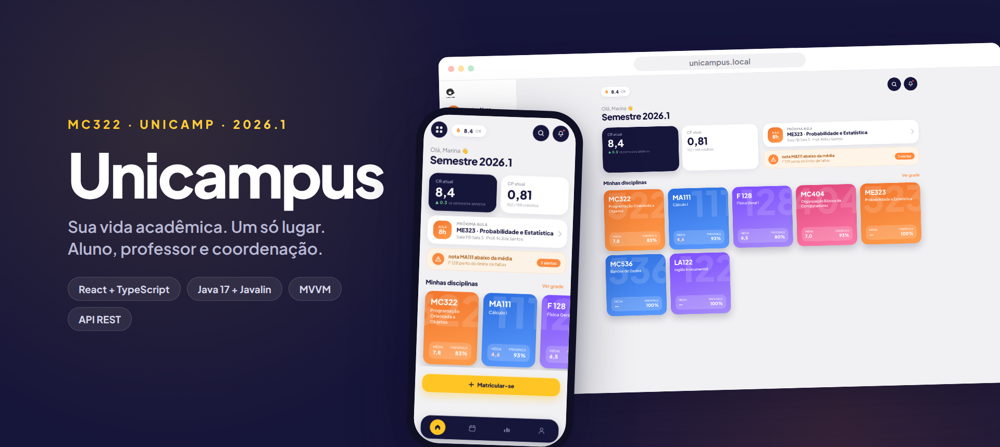
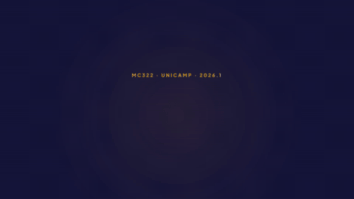
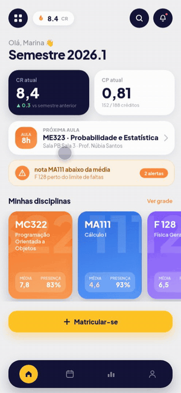
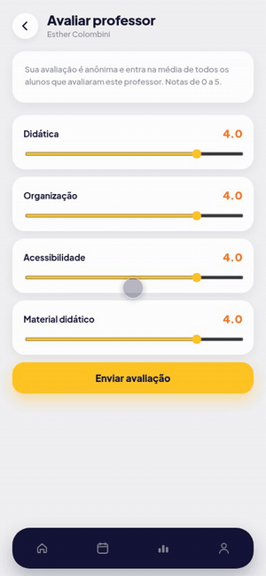
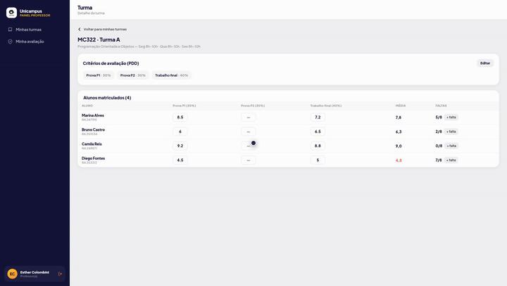
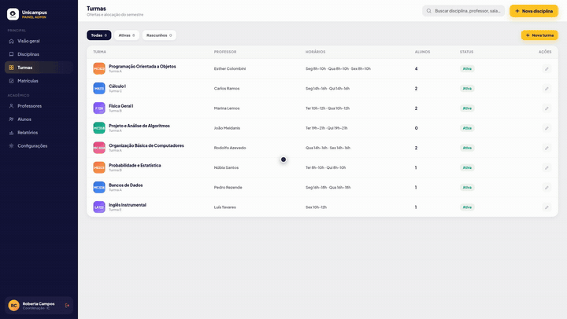
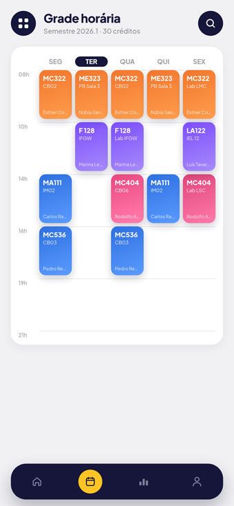
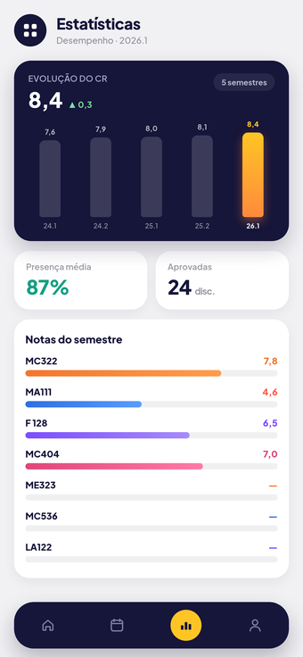
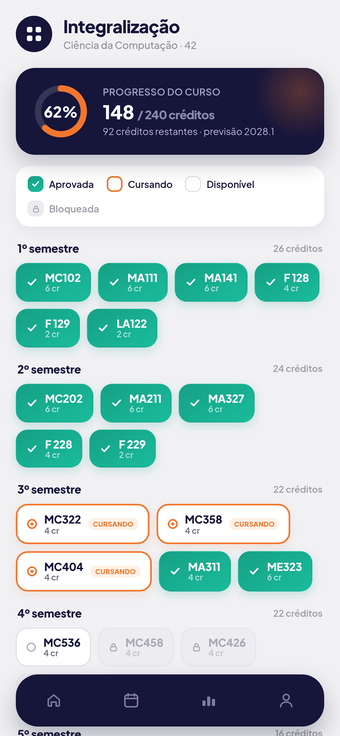

<p align="center">
  
</p>

# Unicampus — Gestão Acadêmica (MC322 · Trabalho Final)

App de gestão acadêmica da Unicamp com três papéis — **Aluno**, **Professor** e
**Coordenação (Admin)** — cada um com seu próprio dashboard.

| Parte | Pasta | Stack |
|---|---|---|
| Frontend (interface web) | [`frontend/`](frontend/) | React + Vite + TypeScript (MVVM) |
| Backend (API REST) | [`backend/`](backend/) | Java 17 + Gradle + Javalin (POO, arquivos JSON, JUnit 5) |

## 🎬 Demo

<p align="center">
  
</p>

<p align="center">
  🎥 <b><a href="video-apresentacao/out/UnicampusTrailer.mp4">Assista ao trailer completo em 1080p</a></b> — todas as funcionalidades em 60 segundos.
</p>

| 📱 Matrícula em poucos toques | 📱 Avaliação de professores |
| :---: | :---: |
|  |  |

| 🧑‍🏫 Professor — lançamento de notas | 🏛️ Coordenação — gestão de turmas |
| :---: | :---: |
|  |  |

<details>
<summary>📸 Mais telas do app (aluno)</summary>
<p align="center">
  
  
  
</p>
</details>


## Rodando o sistema completo

```bash
# 1. Backend (http://localhost:8080/api)
cd backend && ./gradlew run

# 2. Frontend (http://localhost:5173) — em outro terminal
cd frontend
echo 'VITE_API_URL=http://localhost:8080/api' > .env
npm install && npm run dev
```

Contas de demonstração (senha `123456`): aluna `247195` · professora `000101` ·
coordenação `000042`. Sem o `.env`, o frontend roda sozinho em modo mock.

Documentação: [`frontend/README.md`](frontend/README.md) (interface e contrato da API),
[`frontend/BUSINESS_RULES.md`](frontend/BUSINESS_RULES.md) (regras de negócio e papéis),
[`backend/README.md`](backend/README.md) (arquitetura POO, requisitos do enunciado) e
[`backend/docs/`](backend/docs/) (diagramas UML).
