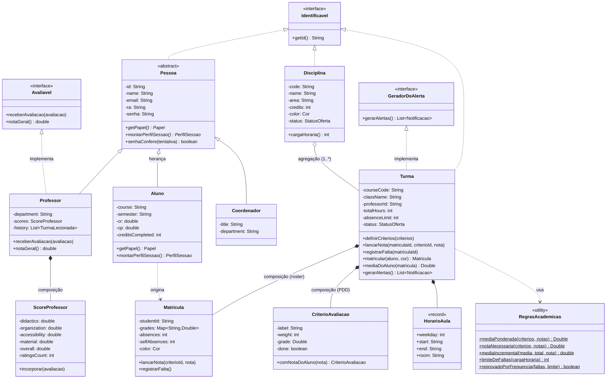
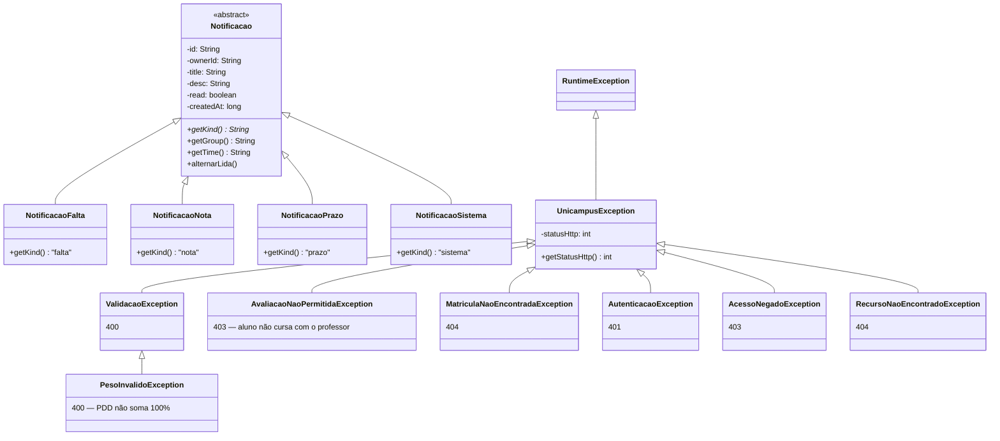
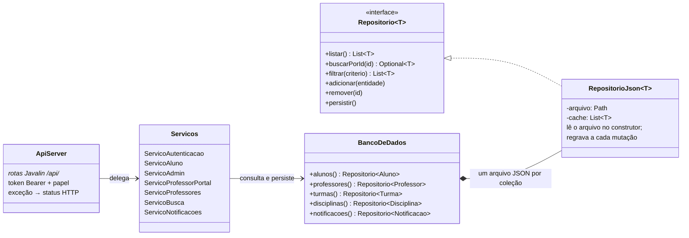

# Unicampus — Diagrama de Classes (UML)

> Renderiza direto no GitHub e no VSCode (extensão Markdown Preview Mermaid).
> A versão PlantUML (para o relatório) está em [`diagrama-classes.puml`](diagrama-classes.puml).

## Domínio — pessoas, turmas e avaliação

## Notificações (polimorfismo) e exceções

## Persistência e camadas

**Fluxo típico** (professor lança falta): `PUT/POST /api/professor/turmas/:id/...` →
`ApiServer` valida token e papel → `ServicoProfessorPortal` confere que a turma é do
professor → `Turma.registrarFalta()` (domínio) → `Repositorio.persistir()` grava
`turmas.json` → `Turma.gerarAlertas()` (interface `GeradorDeAlerta`) produz uma
`NotificacaoFalta` para o aluno → gravada em `notificacoes.json`.
